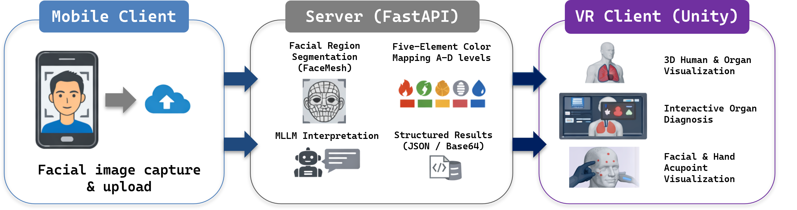

# Acupuncture TCM VR

An interactive virtual-reality system that visualizes Traditional Chinese Medicine (TCM) facial diagnostics using a multimodal large language model. A user's facial photo is mapped to the Five Zang Organs and the Five-Element color associations, then explored in immersive 3D — letting users navigate facial regions, internal organs, and related acupoints through direct interaction.

The goal is **cultural and educational visualization, not medical diagnosis.**



## How it works

```
┌──────────────────┐   image    ┌──────────────────┐   JSON    ┌──────────────────────┐
│  Mobile client   │ ─────────► │  FastAPI server  │ ────────► │  VR client (Unity)   │
│                  │            │                  │           │                      │
│  capture &       │            │  face landmarks  │           │  3D human + organs   │
│  upload          │            │  5-element map   │           │  diagnostic panel    │
│                  │            │  Qwen-VL text    │           │  3D acupoints        │
└──────────────────┘            └──────────────────┘           └──────────────────────┘
```

1. **Mobile / web client** — uploads a facial image to the server.
2. **Server (this repo)** — runs OpenCV Haar detection + MediaPipe FaceMesh (468 landmarks) to localize forehead / glabella / nose bridge / cheeks / chin, computes per-region average RGB, snaps each to one of four Five-Element color levels (A → D), and queries Qwen-VL for an English observational paragraph.
3. **VR client (Unity, Meta Quest 3)** — fetches the structured result and renders annotated facial images, a 3D human model with color-graded internal organs, an interactive five-organ panel, and head/hand acupoint markers.

## Repo layout

```
acupuncture-tcm-vr/
├── server/
│   ├── server.py           # FastAPI service (upload, analyze, render)
│   └── requirements.txt
├── docs/
│   ├── abstract.pdf        # Two-page system overview
│   ├── user_guide.pdf      # Install / usage / troubleshooting
│   ├── presentation.pptx   # Final presentation slides
│   └── screenshot.png      # Workflow figure
└── README.md
```

The Unity project, the built `Quest_XueWei.apk`, and the demo video are hosted **outside this repo** due to size (multi-GB Unity project, hundreds of MB for the apk and video).

## Server setup

Requires Python 3.9+ and a [DashScope](https://dashscope.aliyuncs.com/) API key with access to `qwen-vl-max-latest`.

```bash
cd server
python -m venv .venv
# Windows
.venv\Scripts\activate
# macOS / Linux
source .venv/bin/activate

pip install -r requirements.txt

# Set your Qwen-VL key (DO NOT commit)
# Windows PowerShell
$env:DASHSCOPE_API_KEY = "sk-..."
# macOS / Linux
export DASHSCOPE_API_KEY="sk-..."

uvicorn server:app --host 0.0.0.0 --port 8000
```

Open `http://localhost:8000/` for a minimal upload page; the VR client polls `GET /latest` for the most recent result.

### Endpoints

| Method | Path | Purpose |
| --- | --- | --- |
| `POST` | `/upload` | Multipart form upload of one image; returns analysis JSON + base64 previews |
| `GET`  | `/latest` | Latest analysis (JSON) for VR clients to poll |
| `GET`  | `/latest_json` | Latest result as a downloadable JSON file |
| `GET`  | `/image/{task_id}/{kind}` | `kind` ∈ {`original`, `combined`, `heart`, `liver`, `spleen`, `lung`, `kidney`} |

## VR client setup (Meta Quest 3)

1. Install [SideQuest](https://sidequestvr.com/) and enable [Developer Mode](https://developer.oculus.com/documentation/native/android/mobile-device-setup/) on the headset.
2. Connect the Quest 3 over USB-C and sideload the prebuilt APK.
3. Launch the app and point it at your running server.

See [`docs/user_guide.pdf`](docs/user_guide.pdf) for full install, usage, and troubleshooting (loading screen stuck, hand tracking issues, etc.).

## Five-Element color mapping

| Organ  | Facial region | Element | Color levels A → D                                            |
| ------ | ------------- | ------- | ------------------------------------------------------------- |
| Heart  | Forehead      | Fire    | `#F4A3A3` → `#F26A6A` → `#D83434` → `#9C1C1C`                 |
| Liver  | Glabella      | Wood    | `#A8D5BA` → `#6BBF59` → `#3F9142` → `#1E5631`                 |
| Spleen | Nose bridge   | Earth   | `#F7E3A3` → `#F2CC5C` → `#E0A800` → `#B58100`                 |
| Lung   | Cheeks        | Metal   | `#F9F9F9` → `#E5E5E5` → `#CCCCCC` → `#B3B3B3`                 |
| Kidney | Chin          | Water   | `#A0A4B8` → `#6B7280` → `#374151` → `#111827`                 |

## Documentation

- [Two-page abstract](docs/abstract.pdf) — system overview and references
- [User guide](docs/user_guide.pdf) — step-by-step install + troubleshooting
- [Presentation](docs/presentation.pptx) — final project deck

## Course context

Final project for **COMS E6173 Virtual Reality and Augmented Reality**, Columbia University, Fall 2025.

## Disclaimer

This system visualizes traditional cultural concepts for educational purposes. It does not provide medical diagnosis, prognosis, or treatment recommendations. Outputs from the multimodal model are observational descriptions only.
